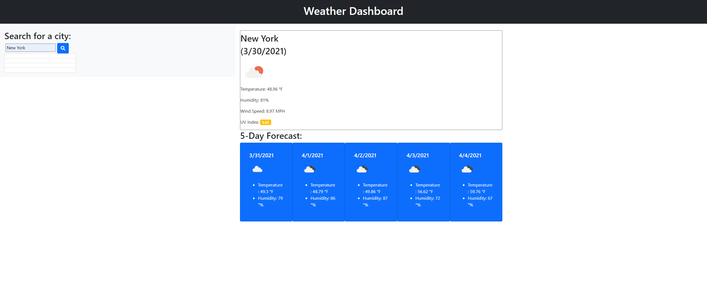

# Weather-Dashboard
This application is a weather report, displaying the weather at the moment for the city the user searches for. It will display the five day forecast for that city as well as keep the search history upon refresh.
Here is what the application looks like: 

# Deployed Page
Here is a link to the deployed site: [Deployed Site](https://julesscheil.github.io/Weather-Dashboard/)
